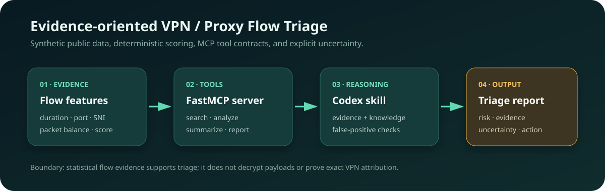
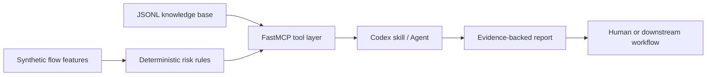

<div align="center">

# VPN Flow Analyst MCP

**Evidence-oriented MCP tools and a Codex skill for VPN / proxy traffic triage**

[](https://github.com/jiapengLi11/vpn-flow-analyst-mcp/actions/workflows/ci.yml)
[](https://www.python.org/)
[](https://modelcontextprotocol.io/)
[](LICENSE)

[中文设计说明](docs/MCP_DESIGN_ZH.md) · [中文 Skill](skills/vpn-flow-analyst/SKILL.zh-CN.md)

</div>



## Why this project exists

A detector score alone is not enough for a security analyst or an LLM agent. The useful engineering boundary is a small, testable tool layer that turns flow-level signals into **evidence, uncertainty, false-positive checks, and a next action**. This repository packages that layer as five FastMCP tools, a command-line interface, and a reusable Codex skill.

The public repository uses only synthetic flows and generic knowledge notes. It contains no packet captures, private traffic, internal model artifacts, or company data.

## What can be demonstrated

| Capability | Input | Output |
| --- | --- | --- |
| Flow lookup | partial `flow_id` | bounded matching records |
| Deterministic triage | exact `flow_id` | score, level, hit features, evidence |
| Knowledge retrieval | natural-language query | ranked protocol / response notes |
| Report generation | exact `flow_id` | Markdown report with evidence and uncertainty |
| Batch overview | score threshold | highest-risk synthetic flows |

## Real sample output

The following result is produced by `vpn-flow-analyst analyze flow-demo-002` against the committed synthetic dataset:

```json
{
  "flow_id": "flow-demo-002",
  "found": true,
  "label_hint": "encrypted_tunnel",
  "risk_score": 100,
  "risk_level": "high",
  "hit_features": [
    "non_standard_port",
    "encrypted_like_without_sni",
    "long_lived_session",
    "balanced_bidirectional_exchange"
  ],
  "next_action": "Review endpoint context, SNI/domain evidence, and similar false-positive cases."
}
```

This is a triage aid, not a payload decryptor. A high score means the flow deserves review; it does not prove a specific VPN implementation.

## Architecture and reasoning boundary



The MCP server remains deterministic and inspectable. Agent instructions live in `skills/vpn-flow-analyst/SKILL.md`, where the response contract requires risk, evidence, possible false positives, uncertainty, and a recommended action.

## Core tools

- `search_vpn_knowledge(query, limit=5)`
- `search_flows(flow_id_query, limit=10)`
- `analyze_flow(flow_id)`
- `generate_flow_report(flow_id)`
- `summarize_flows(min_risk_score=70, limit=10)`

## Quick start

```bash
python -m venv .venv
# Windows: .venv\Scripts\activate
# Linux/macOS: source .venv/bin/activate
python -m pip install -U pip
pip install -e ".[dev]"
pytest
vpn-flow-analyst analyze flow-demo-002
vpn-flow-analyst report flow-demo-002
```

Start the MCP server over stdio:

```bash
vpn-flow-analyst serve
```

## MCP client configuration

```json
{
  "mcpServers": {
    "vpn-flow-analyst": {
      "command": "python",
      "args": ["-m", "vpn_flow_analyst_mcp.server"],
      "cwd": "C:/path/to/vpn-flow-analyst-mcp"
    }
  }
}
```

When the package is installed in a dedicated environment, point `command` to that environment's Python executable.

## Repository map

```text
src/vpn_flow_analyst_mcp/  FastMCP server and CLI
skills/vpn-flow-analyst/   English and Chinese Codex skills
data/                      synthetic flows and public-style knowledge
docs/                      architecture and Chinese design notes
tests/                     tool, registry, boundary, and skill tests
.github/workflows/         reproducible CI on Python 3.10 and 3.12
```

## Engineering decisions

- **Deterministic core, agentic edge:** scoring and evidence extraction stay in Python; language generation is downstream.
- **Auditable evidence:** every result exposes the features that influenced the score.
- **Bounded retrieval:** tools cap returned records instead of sending an unbounded dataset to an agent.
- **Explicit uncertainty:** the skill forbids claims of payload decryption or exact attribution without supporting evidence.
- **Sanitized demonstration:** committed IDs, IP-like fields, and examples are synthetic.

## Limitations and next steps

- The current scorer is rule-based and intended to demonstrate tool contracts, not production detection accuracy.
- Knowledge retrieval uses transparent term matching rather than embeddings.
- Production use would require authenticated data access, schema validation, observability, rate limits, and evaluation against labeled traffic.
- A useful next iteration is an offline evaluation harness comparing detector labels, analyst decisions, and generated reports.

## Interview summary

> I separated statistical flow analysis from LLM reasoning. A deterministic FastMCP service exposes bounded search, evidence extraction, risk scoring, and report generation, while a Codex skill constrains the agent to cite signals, discuss false positives, and state uncertainty. I added a CLI, packaging, boundary tests, CI, and sanitized sample data so the project can be reproduced without private traffic.

## Data safety

- No raw PCAP files or private captures.
- No production endpoint identifiers.
- No model checkpoints or internal deployment documents.
- Synthetic sample flows are intentionally small and inspectable.

## License

[MIT](LICENSE)
